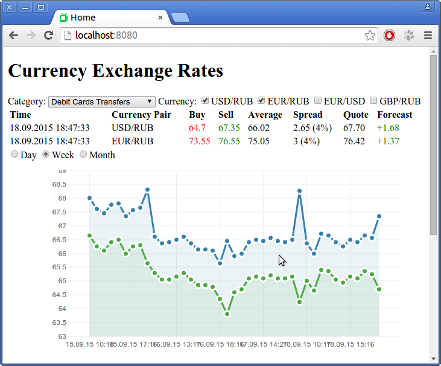

Currency Exchange Rates Watcher
===============================

Web application monitors changes in foreign exchange rates.

Developed using Spring Framework, Jackson JSON Processor, Hibernate, MySQL, Websockets, jQuery,
Backbone.js, Underscore.js and xCharts.

Application requires:

* JRE 7,
* Apache Tomcat 7 at least.

###Screenshots###



###Install###

Create database:

```
mysql> create user 'rates'@'localhost' identified by 'P@ssw0rd';
mysql> create database rates;
mysql> grant all privileges on rates.* to 'rates'@'localhost';
mysql> exit;
```

Create tables:

```
$ mysql -u rates -p rates < sql/mysql_schema.sql
```

Add options to CATALINA_OPTS variable:

`-DcurrencyWatcherConfig=/currency-watcher/src/main/config -DcurrencyWatcherLogs=/currency-watcher/log`

where: 

- currencyWatcherConfig - path to directory with application config,
- currencyWatcherLogs - path to directory with application logs.
